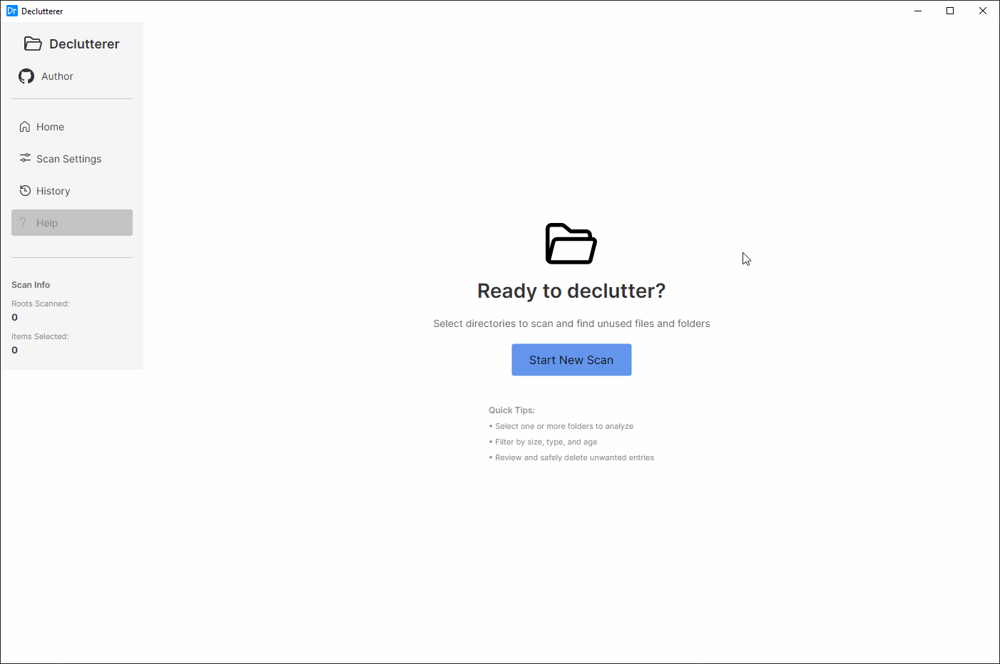

# Declutterer

Declutterer is a cross-platform desktop application for scanning, analysing, and cleaning up large or old files and directories. It presents your file system as an interactive tree, lets you filter and score items by size and age, and offers smart auto-selection so that you can identify clutter quickly and delete it either to the Recycle Bin/Trash or permanently.

## Showcase


## Functionalities

- **Directory scanning** – scan one or more root directories with configurable filters (minimum file/directory size, modified-before date, accessed-before date, include/exclude files).
- **Smart selection** – automatically scores and selects the top candidates based on weighted size and age criteria.
- **Manual selection** – toggle individual nodes or select/deselect all via the tree grid's checkboxes.
- **Delete to Recycle Bin** – safely moves selected items to the platform Recycle Bin / Trash with progress tracking and cancellation support.
- **Permanent delete** – irreversibly removes selected items with the same progress/cancellation guarantees.
- **Deletion history** – every deletion is recorded; the history view lets you review or remove history entries.
- **Copy path** – right-click any node to copy its full path to the clipboard.
- **Open in Explorer** – right-click to reveal an item in the system file manager.
- **Expand/collapse all** – Alt-click a directory to expand or collapse the entire subtree.
- **Safety guard** – built-in validation blocks deletion of known system-critical directories on Windows, Linux, and macOS.

## Technical Overview

| Layer | Technology |
|---|---|
| UI framework | [Avalonia UI](https://avaloniaui.net/) |
| MVVM | CommunityToolkit.Mvvm |
| Logging | [Serilog](https://serilog.net/) (Debug builds: console output; Release builds: Fatal-only) |
| Dependency injection | Microsoft.Extensions.DependencyInjection |
| Test framework | xUnit + NSubstitute |

### Architecture

```
src/
├── Declutterer/
│   ├── Abstractions/          – service interfaces (IDeleteService, IClipboardService, …)
│   ├── Application/           – app entry point, DI registration, Serilog configuration
│   ├── Domain/
│   │   ├── Models/            – TreeNode, ScanOptions, DeletionHistoryEntry, …
│   │   ├── Services/
│   │   │   ├── Deletion/      – DeleteService (recycle bin + permanent delete)
│   │   │   ├── Scanning/      – DirectoryScanService, ScanFilterService
│   │   │   └── Selection/     – SmartSelectionService, SmartSelectionScorer
│   │   └── History/           – DeletionHistoryRepository
│   ├── UI/
│   │   ├── ViewModels/        – MainWindowViewModel, CleanupWindowViewModel, …
│   │   ├── Views/             – XAML windows and controls
│   │   └── Services/          – Clipboard, Dialog, Navigation, Workflow, …
│   └── Utilities/             – ByteConverter, TreeNodeHelper, PathExtensions, …
└── Declutterer.Tests/         – xUnit integration and unit tests
```

### Logging

Both the static `Serilog.Log` class and the injected `ILogger<T>` (registered via `AddSerilog()`) pass through the same Serilog pipeline. In **Debug** builds the pipeline writes to the console at `Debug` level and above. In **Release** builds `MinimumLevel.Fatal()` effectively silences all non-fatal log output from both logging paths.


## How to Build and Run

### Prerequisites

- [.NET 10 SDK](https://dotnet.microsoft.com/download)
- Windows 10/11 (or Linux / macOS for cross-platform builds)

### Build

```bash
dotnet build src/Declutterer/Declutterer.csproj
```

### Run

```bash
dotnet run --project src/Declutterer/Declutterer.csproj
```

Or publish a self-contained executable:

```bash
dotnet publish src/Declutterer/Declutterer.csproj -c Release -r win-x64 --self-contained
```

### Run Tests

```bash
dotnet test src/Declutterer.Tests/Declutterer.Tests.csproj
```

Run a specific test class:

```bash
dotnet test src/Declutterer.Tests/Declutterer.Tests.csproj --filter "FullyQualifiedName~DeleteServiceTests"
```
